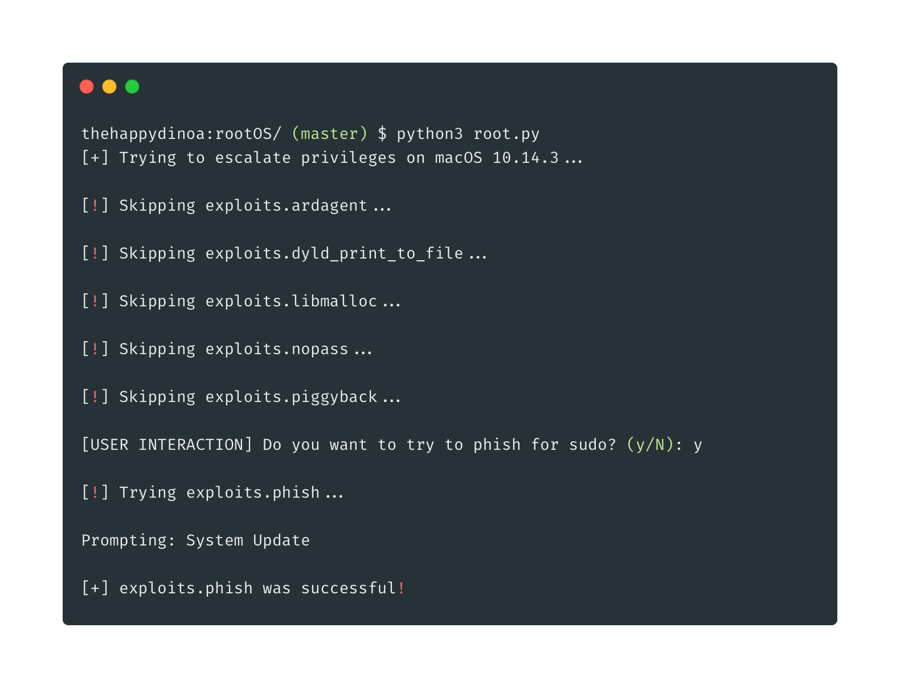
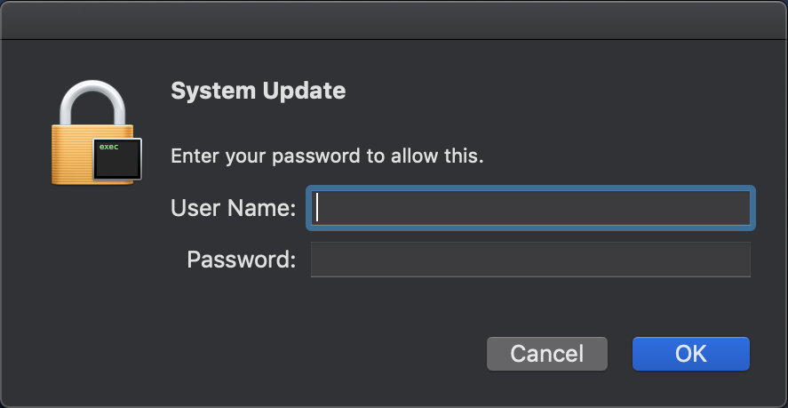

# rootOS

Tries to use various CVEs to gain sudo or root access. All exploits have an end goal of adding `ALL ALL=(ALL) NOPASSWD: ALL` to `/etc/sudoers` allowing any user to run `sudo` commands.



## Run

```bash
python root.py
```

## Exploits

| Name                         | CVE            | Date       | Link(s)                                                                                                |
| ---------------------------- | -------------- | ---------- | ------------------------------------------------------------------------------------------------------ |
| ARDAgent                     | CVE-2008-2830  | 06/23/2008 | <https://nvd.nist.gov/vuln/detail/CVE-2008-2830>                                                       |
| DYLD_PRINT_TO_FILE           | CVE-2015-3760  | 08/16/2015 | <https://nvd.nist.gov/vuln/detail/CVE-2015-3760> <https://twitter.com/i0n1c/status/623727538234368000> |
| MallocLog                    | CVE-2015-5889  | 0/09/2015  | <https://nvd.nist.gov/vuln/detail/CVE-2015-5889>                                                       |
| Proxifier Sanitize           | CVE-2017-7643  | 04/14/2017 | <https://nvd.nist.gov/vuln/detail/CVE-2017-7643>                                                       |
| Sera Local Pass              |                | 10/31/2017 | <https://m4.rkw.io/blog/cve201715918-sera-12-local-root-privesc-and-password-disclosure.html>          |
| NoPass                       | CVE-2017-13872 | 11/29/2017 | <https://nvd.nist.gov/vuln/detail/CVE-2017-13872> <https://objective-see.com/blog/blog_0x24.html>      |
| KeySteal                     | CVE-2019-8526  | 06/01/2019 | <https://github.com/LinusHenze/Keysteal>                                                               |
| AppleScript Dynamic Phishing |                |            | <https://github.com/thehappydinoa/rootOS/blob/master/apps.json>                                        |
| Sudo Piggyback               |                |            | <https://www.n00py.io/2016/10/privilege-escalation-on-os-x-without-exploits/>                          |

## Dynamic Phishing



Please note the dynamic icon and prompt

## License

[MIT](LICENSE)
