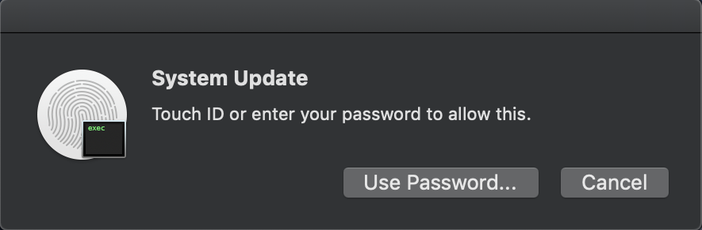

# rootOS

Tries to use various CVEs to gain sudo or root access. All exploits have an end goal of adding `ALL ALL=(ALL) NOPASSWD: ALL` to `/etc/sudoers` allowing any user to run `sudo` commands.


## Exploits

-   CVE-2008-2830
-   CVE-2015-3760
-   CVE-2015-5889
-   CVE-2017-13872
-   AppleScript Dynamic Phishing
-   [Sudo Piggyback](https://www.n00py.io/2016/10/privilege-escalation-on-os-x-without-exploits/)

## Run

```bash
python root.py
```

## Dynamic Phishing


[](https://app.fossa.io/projects/git%2Bgithub.com%2Fthehappydinoa%2FrootOS?ref=badge_shield)




## License
[](https://app.fossa.io/projects/git%2Bgithub.com%2Fthehappydinoa%2FrootOS?ref=badge_large)